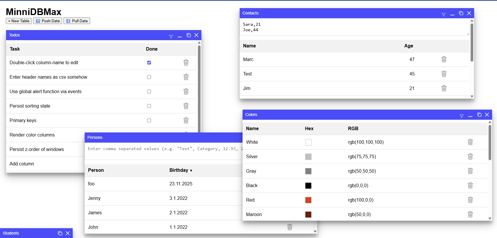
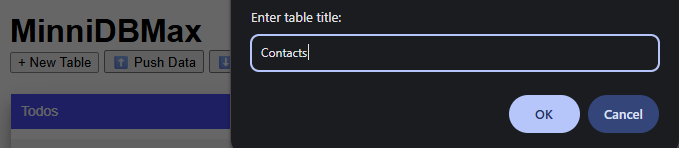
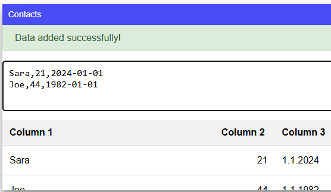
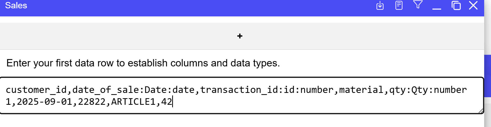
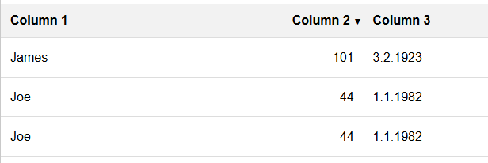
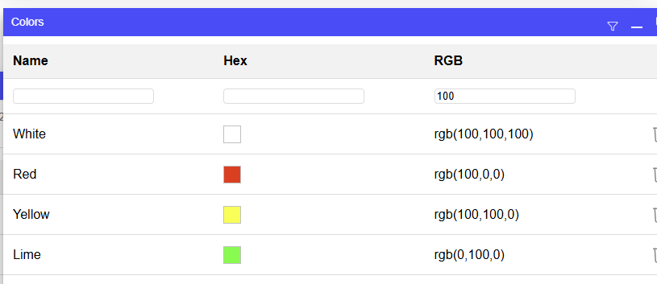

# MinniDBMax
Simple database with CSV import/export for viewing, managing structured data in a windowed-interface

Check it out at: http://cawoodm.github.io/minnidbmax/

## How to Use
To begin, create a new table, paste (or drag and drop) some CSV data and press Enter to import.  

You can press Shift+Enter to add more than one line

The first time you paste data the first row is used to infer data types (string, number, date, bool).    

You can however start with a header line the first time you import data (before any columns are defined):  
  
Note you can specify a different label for the column from the technical field name as well as the type, default and max length:
* `foo:Foo:number:1` Field name `foo` with label `Foo` of type `number` and default `1`
* `sales_id:Sales Identifier:string::12` Field name `sales_id` with label `Sales Identifier` of type `string` , no default but a max length of `12`

This aids with proper sorting.  

Click filter to filter columns, enter a search term and press enter:  

### Other:

* Double click a column label to rename it.
  * When you first import data the fields: field_1, field_2 etc... are automatically created with labels "Column 1", "Column 2" etc.
  * The first time you rename a column, the label is converted to a field name
* Click delete icon to delete a row
* Click the window close icon to delete a table
* Open a new space with `?space=something`
  * Default space is `?space=default`

## Data Storage
Every change is immediately stored in your browsers `localStorage`.
In order to Push/Pull data you need to [create](http://gist.github.com/) a (preferably Secret) Gist and supply the GistID and an [API token](https://docs.github.com/en/rest/gists/gists?apiVersion=2022-11-28#list-gists-for-the-authenticated-user) by entering them in your JS Console (press Ctrl+Shift+I or F12):
* `localStorage.setItem('minnidb-gist-token', 'github_pat_***')`
* `localStorage.setItem('minnidb-gist-id', 'c4c***')`
You will now be able to synch your data with this Gist for free on Github.

### Limitations
* Gist files are limited to 1MB
